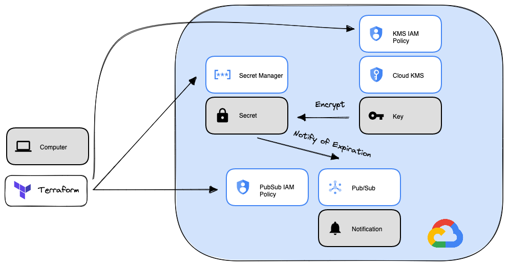

# terraform-google-secret-manager

This modules makes it easy to create Google Secret Manager secrets. If enabled it can enable the use of KMS keys for encrypting the secrets. Also if rotation is enabled and pubsub topics are passed in, then notification about secret rotation are sent to the pubsub topics. Here is a diagram of the resources that are deployed:



## Usage

Basic usage of this module is as follows:

```hcl
module "secret-manager" {
  source  = "GoogleCloudPlatform/secret-manager/google"
  version = "~> 0.9"
  project_id = var.project_id
  secrets = [
    {
      name                     = "secret-1"
      secret_data              = "secret information"
    },
  ]
}
```

Functional examples are included in the [examples](./examples/) directory.

<!-- BEGINNING OF PRE-COMMIT-TERRAFORM DOCS HOOK -->
## Inputs

| Name | Description | Type | Default | Required |
|------|-------------|------|---------|:--------:|
| add\_kms\_permissions | The list of the crypto keys to give secret manager access to | `list(string)` | `[]` | no |
| add\_pubsub\_permissions | The list of the pubsub topics to give secret manager access to | `list(string)` | `[]` | no |
| automatic\_replication | Automatic replication parameters that will be used for defined secrets. If not provided, the secret will be automatically replicated using Google-managed key without any restrictions. | `map(object({ kms_key_name = string }))` | `{}` | no |
| labels | labels to be added for the defined secrets | `map(map(string))` | `{}` | no |
| project\_id | The project ID to manage the Secret Manager resources | `string` | n/a | yes |
| secret\_accessors\_list | The list of the members to allow accessing secrets | `list(string)` | `[]` | no |
| secrets | The list of the secrets | <pre>list(object({<br>    name : string,<br>    secret_data : optional(string),<br>    next_rotation_time : optional(string),<br>    rotation_period : optional(string),<br>    create_version : optional(bool, true)<br>  }))</pre> | `[]` | no |
| topics | topics that will be used for defined secrets | `map(list(object({ name = string })))` | `{}` | no |
| user\_managed\_replication | Replication parameters that will be used for defined secrets | `map(list(object({ location = string, kms_key_name = string })))` | `{}` | no |

## Outputs

| Name | Description |
|------|-------------|
| secret\_names | The name list of Secrets |
| secret\_versions | The name list of Secret Versions |

<!-- END OF PRE-COMMIT-TERRAFORM DOCS HOOK -->

## Requirements

These sections describe requirements for using this module.

### Software

The following dependencies must be available:

- [Terraform][terraform] v0.13
- [Terraform Provider for GCP][terraform-provider-gcp] plugin v3.0

### Service Account

A service account with the following roles must be used to provision
the resources of this module:

- Secret Manager Admin: `roles/secretmanager.admin`

If you want the module to change IAM permissions (for the pubsub and kms use cases), it will require the following additional roles:

- Project IAM Admin: `roles/resourcemanager.projectIamAdmin`

The [Project Factory module][project-factory-module] and the
[IAM module][iam-module] may be used in combination to provision a
service account with the necessary roles applied.

### APIs

A project with the following APIs enabled must be used to host the
resources of this module:

- Secret Manager API: `secretmanager.googleapis.com`

The [Project Factory module][project-factory-module] can be used to
provision a project with the necessary APIs enabled.

## Contributing

Refer to the [contribution guidelines](./CONTRIBUTING.md) for
information on contributing to this module.

[iam-module]: https://registry.terraform.io/modules/terraform-google-modules/iam/google
[project-factory-module]: https://registry.terraform.io/modules/terraform-google-modules/project-factory/google
[terraform-provider-gcp]: https://www.terraform.io/docs/providers/google/index.html
[terraform]: https://www.terraform.io/downloads.html

## Security Disclosures

Please see our [security disclosure process](./SECURITY.md).
